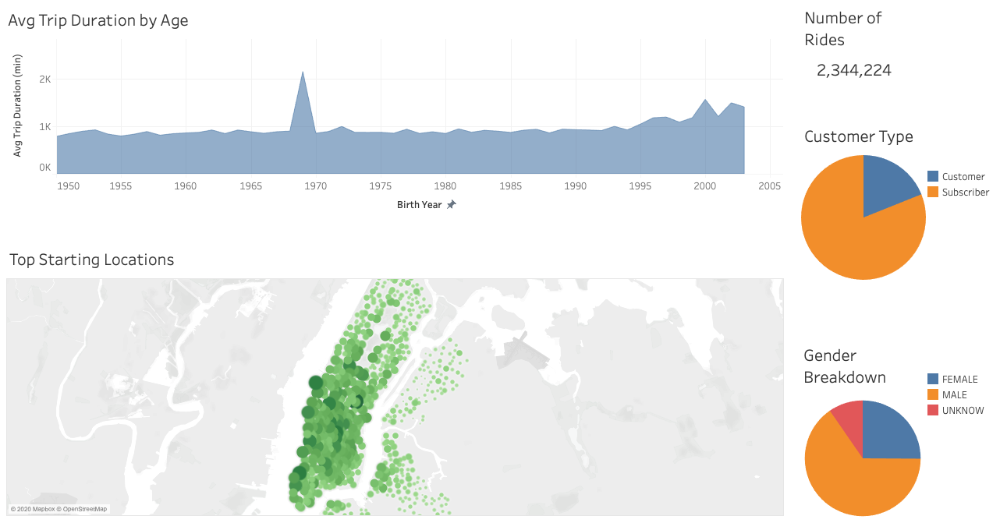
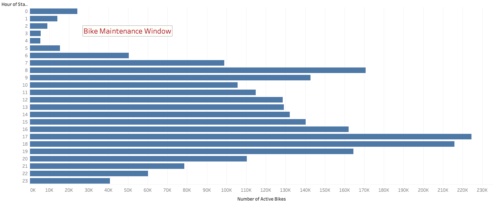
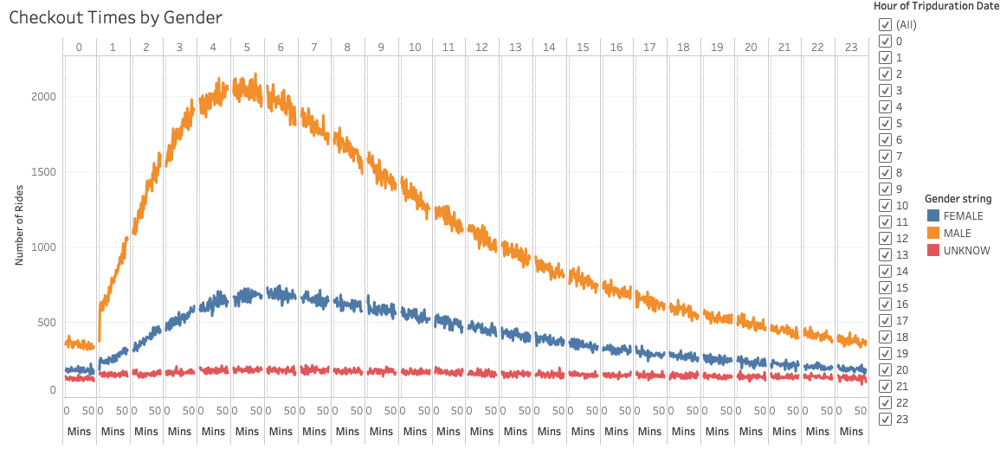
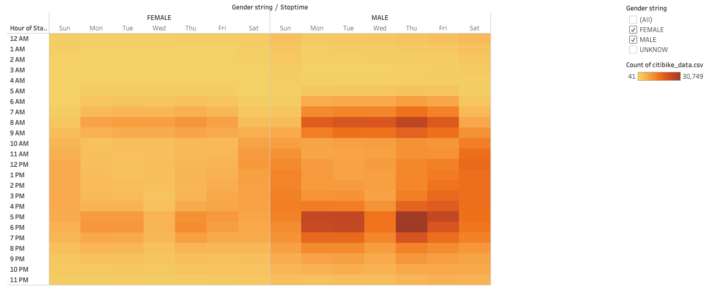

# bikesharing

## Purpose
This project is an analysis of New York Citi Bike data, using data visualization via Tableau to discover if a bike-sharing business is a successful investment.

## Link to Dashboard
[link to dashboard](https://public.tableau.com/profile/rob1264#!/vizhome/NYCCitiBikeChallenge_16208710728380/NYCCitiBikeStory?publish=yes)

## Results
### New York Citi Bike data visualizations for August 2019

*There were over 2.3 million rides for the month of August 2019.
*81% of the users were subscribers. 65% of the users were confirmed males and 25% were confirmed females.
*There is a wide range of the age of the users. Younger users tend to use the service for longer rides.
*Top ride starting locations are in the most touristic and busy areas, as we see here in Manhattan.

### August Peak Hours

*Highest activity hours are from 5:00 PM to 7:00 PM and require the most resources mobilized.
*The activity from 2:00 AM to 5:00 AM is low so this would be the window for bike maintenance.

### Checkout times for users

*Bikes are mostly checked out for 4 to 6 hours.

### Checkout times by gender

*Male users take approximately 3 times more rides than the female users.

### Trips by weekday and gender

*Most weekday rides are around 7:00 AM to 9 AM and 5:00 PM to 7:00 PM.
*Weekend rides are highest from 10:00 AM to 7:00 PM.
*Those rides are mostly taken by male users.

## Summary
The data shows a lot of activity from the bike sharing service in New York during the month of August 2019. Most of the rides occurred in Manhattan, and male bikers were the majority of bikers. Regardless of gender, most bikers rode their bikes during the morning and evening rush hours. This implies that Citi Bike services are used as an alternative form of transportation for commuting workers.

Additionally it would be worthwhie to perform analysis:

*including weather data to find the correlation between the weather and the rides (I assume less people bike when it rains/snows)
*comparing data for different months to determine trends across the year to see if people biking is cyclical/seasonal

